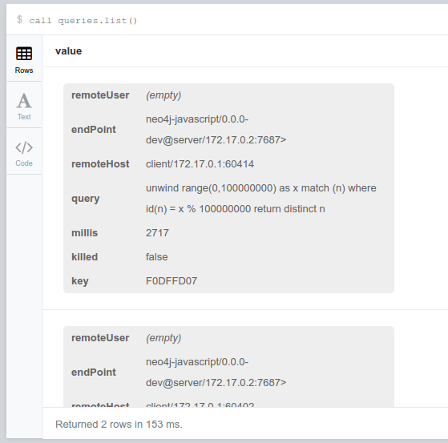
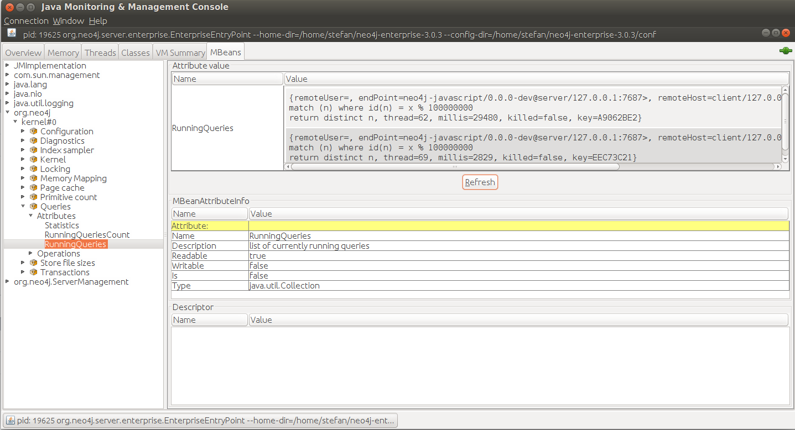

== neo4j-querykiller

https://github.com/sarmbruster/neo4j-querykiller/releases[image:https://img.shields.io/github/release/sarmbruster/neo4j-querykiller.svg[Release Status]] https://travis-ci.org/sarmbruster/neo4j-querykiller[image:https://img.shields.io/travis/sarmbruster/neo4j-querykiller.svg[Build Status]]

A often asked question from Neo4j users is: Can I terminate a query that is running much longer than expected since it might consume CPU and other resources?

Some time ago Neo4j introduced a way to terminate running transactions. E.g. in the Neo4j browser you can cancel a query by clicking on the "X" button. However as of today Neo4j does not provide a way to do the same with transactions initiated programmatically by a client. This is the reason to start `neo4j-querykiller`.

This project's main goal is to provide a convenient way to terminate individual cypher queries running on a Neo4j server. A secondary goal is to provide statistics on how long and how often a certain query is executes. This information basically gives the most impacting queries as candidates for optimization.

To inspect the list of running queries and terminating them `neo4j-querykiller` supports 4 different communication channels:

. via Cypher stored procedures
. via HTTP
. via `neo4j-shell`
. via JMX bean

=== Installation

==== Requirements

`neo4j-querykiller` works on Neo4j >= 3.0.0.

==== Download or build from source

Either download the latest jar file provided in link:releases/ or build it from source. Use [gradle](http://www.gradle.org) to build the project:

    ./graldew build shadowJar
    
The `shadowJar` task creates one single jar file containing the code of neo4j-querykiller itself and those of its dependencies not being part of the neo4j distribution.

Copy (or symlink) the resulting file `./build/libs/neo4j-querykiller-1.0.0-SNAPSHOT-all.jar` into Neo4j's `/plugins` folder.

==== Configuration and setup

`neo4j-querykiller` uses a technique called bytecode instrumentation to hook into Neo4j. To enable that the JVM requires a `javaagent` setting. In `conf/neo4j-wrapper.conf` add the following line (replace `<version>` with your current version):

    dbms.jvm.additional=-javaagent:plugins/neo4j-querykiller-<version>-all.jar

.For docker users
TIP: Neo4j default docker images don't allow to directly pass JVM arguments. Therefore use the `dump-config` approach described at https://neo4j.com/developer/docker-3.x/#__code_conf_code_volume. Take care, when using docker the jvm config needs to have a "/" in front of plugins: `dbms.jvm.additional=-javaagent:/plugins/neo4j-querykiller-<version>-all.jar`

==== optional: configure REST endpoints

Optionally you can enable REST endpoints to get a list of running queries and manage them. For this add the following line to `conf/neo4j.conf`:

    dbms.unmanaged_extension_classes=org.neo4j.extension.querykiller.server=/querykiller

////
    when statistics module is ready, amend this:
    ,org.neo4j.extension.querykiller.statistics=/statistics
////

After a restart using `$NEO4J_HOME/bin/neo4j restart` the `neo4j-querykiller` extensions are active.

== Features

=== list running queries

`neo4j-querykiller` exposes a list of the currently running cypher queries using a stored procedure, in Neo4j browser just type:

    call queries.list()

and you'll get back a result column `value` containing a map for each running query:

.Meaning of columns
[options="header"]
|=====
|column name |description
|remoteUser |user name sending the query
|endPoint |endpoint being used - indicates also the driver
|remoteHost	|client ip address and port
|query |cypher query string
|millis |for how long is this query already running
|killed |true if this query already has been marked as killed
|key |hashcode used to kill this query
|=====

If enabled in configuration (see above) the very same list available via HTTP as well by sending a GET request to http://localhost:7474/querykiller/. This returns a JSON array with a hashmap for each running query containing the very same information sketch above.

When using `neo4j-shell` you can use the `query` command to list all running queries.

Via JMX there's a Bean `Queries` on the same level as other Neo4j JMX Beans. This one has an attribute `RunningQueries` containing a collection of the above structure, see a screenshot of jConsole as example

=== killing a running query

To terminate a query run

    call queries.kill(<key>)

or send a HTTP DELETE to http://localhost:7474/querykiller/<key> where `<key>` is one of the keys from the query list above.

In `neo4j-shell` use `query -k <key>` to terminate a given query.

JMX Bean `Queries` has a `terminate` method taking the `<key>` as parameter.

== an example

tbd

////
=== using cypher

An example
----------

Create long running query:

    curl -X POST -H Accept:application/json -H Content-Type:application/json -d '{"query": "MATCH (a)-[r*]-(c) RETURN a"}' -v  http://localhost:7474/db/data/cypher

Check which queries are running:

    curl http://localhost:7474/querykiller/
    [{"cypher":"MATCH (a)-[r*]-(c) RETURN a","endPoint":"/cypher","thread":92,"since":3847,"key":"2161824329","remoteUser":null,"remoteHost":"127.0.0.1"}]

Kill the query by using the 'key' value from the previous query:

    curl -X DELETE http://localhost:7474/querykiller/2161824329
    
### statistics
    
Querykiller implements the observer pattern. One observer is statistics. Using config option `extension.statistics.enabled=false` in `neo4j.properties` this can be switched off.

Get a list of all queries run so far:

    curl http://localhost:7474/statistics/

    {
        "[\"MATCH (n:Person) RETURN n LIMIT 25\"]": {
            "durations": {
                "2015-04-04T12:11:57.358+0000": 1200, 
                "2015-04-04T12:12:05.929+0000": 7
            }, 
            "total": 1207
        }, 
        "[\"MATCH a -[r]- b WHERE id(a) IN[0,6,7,8]\\nAND id(b) IN[0,6,7,8]\\nRETURN r;\"]": {
            "durations": {
                "2015-04-04T12:11:58.588+0000": 417, 
                "2015-04-04T12:12:06.005+0000": 8
            }, 
            "total": 425
        }
    }
    
A map is returned. Its keys are the cypher queries, the values are a map holding the aggregated total runtime of this query ("total")
    and a collection of the individual invocations with timestamp and duration.
    
NB: the statistics can grow large and memory consuming, to clear them:

    curl -X DELETE http://localhost:7474/statistics/

////
    
== implementation notes

QueryRegistryExtension is implemented as a kernel extension to Neo4j using link:https://github.com/google/guava/wiki/EventBusExplained[Google Guava's EventBus] as main communication channel .

link:blob/master/src/main/java/org/neo4j/extension/querykiller/agent/WrapNeo4jComponentsAgent.java[JVM agent implementation] instruments couple of internal classes of Neo4j and sends notifications to the event bus. This happens on the following classes:

`org.neo4j.cypher.internal.javacompat.ExecutionEngine`::
    Before and after calls to `executeQuery` and `profileQuery` events of type `CypherContext` and `ResetCypherContext` are sent. These events provied access to the cypher query string used to identify it in the list of running queries
`org.neo4j.kernel.impl.core.ThreadToStatementContextBridge`::
    Hooking into `bindTransactionToCurrentThread` and `unbindTransactionFromCurrentThread` using events of type `BindTransactionEvent` and `UnbindTransactionEvent` allows `QueryRegistryExtension` to be aware when transactions get started and closed.
`org.neo4j.bolt.v1.runtime.internal.SessionStateMachine`::
    Hooking into `run` and `pullAll` sends events of type `BoltContext` and `ResetBoltContext`. This is equivalent to the start and end of a BOLT based interaction.

For getting aware of HTTP request data we register a servlet filter `ExposeHttpContext` using a `SPIPluginLifecycle`.

link:blob/master/src/main/java/org/neo4j/extension/querykiller/QueryRegistryExtension.java[QueryRegistryExtension] is the central class listening to all the events. It also maintains data structures to keep track of running transactions, query strings and query contexts.

TODO: add more stuff here

== some words of warning

. This extension is not developped nor supported by Neo Technology. It's my private pet project - nothing more, nothing less.
. The extension is based on usage of non-public API. So even minor version changes of Neo4j might break it.
. I have not yet measured the performance impact of querykiller. For now the tests just prove that it works functional wise.

== versioning scheme

We're following http://semver.org/[semantic versioning scheme]. See the respective release notes to understand which version of `neo4j-querykiller` works with which version of Neo4j.

////
== further ideas

* [x] gather statistics of queries
* [ ] integration in Neo4j browser
* [x] support for transactional cypher endpoint
* [x] expose querykiller as a JMX bean
* [ ] add tests for shell extension
* [ ] better docs
* [x] make tests more robust (use events instead of static waiting pauses)
* [ ] do measurements on performance impact
////